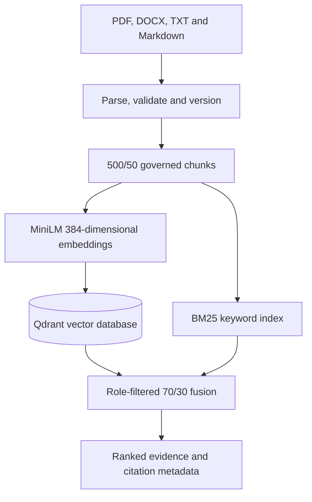

# Enterprise Policy RAG Knowledge Base

An evidence-first enterprise retrieval system that ingests governed documents, generates semantic embeddings, stores vectors persistently, enforces role-based access and returns traceable evidence for downstream RAG applications.

## Current status

Milestones M01–M03 are complete:

- PDF, DOCX, TXT and Markdown parsing
- SHA-256 duplicate detection and immutable version lineage
- Page-aware 500-character chunks with 50-character overlap
- 26 role-tagged benchmark chunks and 20 frozen questions
- 384-dimensional `all-MiniLM-L6-v2` embeddings
- Persistent Qdrant v1.19.0 vector storage
- Deterministic UUID upserts without duplicate points
- BM25 keyword retrieval
- 70% MiniLM/Qdrant and 30% BM25 hybrid ranking
- Role-based filtering before vector ranking
- Evidence text and citation metadata in search results
- Unit and live integration tests
- Reproducible Docker Compose infrastructure

The final answer-generation, citation-formatting and refusal layer remains a subsequent milestone.

## Verified benchmark

Measured locally on the frozen 26-chunk, 20-question benchmark:

| Strategy | Hit@1 | Hit@3 | MRR | Median latency | P95 latency |
|---|---:|---:|---:|---:|---:|
| Hashing-vector baseline | 85% | 95% | 0.8917 | 0.364 ms | 0.619 ms |
| Baseline hybrid | 95% | 100% | 0.975 | 0.364 ms | 0.601 ms |
| MiniLM + Qdrant | 100% | 100% | 1.000 | 25.614 ms | 42.301 ms |
| BM25 production path | 100% | 100% | 1.000 | 0.032 ms | 0.052 ms |
| MiniLM/Qdrant + BM25 hybrid | 100% | 100% | 1.000 | 15.940 ms | 24.991 ms |

Additional verified results:

- 26/26 chunks stored in Qdrant
- 384-dimensional normalized MiniLM vectors
- 18.50 chunks/second during initial collection creation
- 89.49 chunks/second during a warm idempotent upsert
- 0 duplicate points after re-indexing
- 0 unauthorized `VM-02` retrievals in the employee-role test
- 26/26 vectors retained after migrating to Docker Compose
- 13/13 unit and live integration tests passed

See `METRICS.md` for evidence commands and scope limitations.

## Architecture



## Prerequisites

- Linux, macOS or WSL2/Ubuntu
- Python 3.11 or later
- Docker Desktop or Docker Engine with Compose
- Git

No API key or paid cloud account is required for the completed retrieval milestones.

## Start the project

From WSL/Ubuntu:

```bash
cd ~/portfolio-lab/projects/p02-enterprise-rag-knowledge-base

python3 -m venv .venv
source .venv/bin/activate

python -m pip install -e .
docker compose up -d
```

Confirm Qdrant is available:

```bash
curl -sS http://localhost:6333/collections
```

Index the benchmark corpus:

```bash
python scripts/index_corpus_qdrant.py
```

The first embedding run downloads approximately 91 MB for the public MiniLM model. Later runs use the local model cache.

## Search the knowledge base

Run a role-filtered hybrid search:

```bash
python scripts/search_knowledge_base.py \
  "When is multi-factor authentication required and which authentication methods can employees use?" \
  --role all_employees \
  --strategy hybrid \
  --top-k 3
```

Supported strategies:

```text
vector
bm25
hybrid
```

Each result includes:

- rank and retrieval scores
- chunk and document identifiers
- title and section
- document version and effective date
- department and source information
- page number when available
- original evidence text

## Run the benchmark

Offline hashing/BM25 baseline:

```bash
python scripts/evaluate_retrieval.py
```

Production MiniLM, Qdrant and BM25 benchmark:

```bash
python scripts/evaluate_qdrant.py
```

Both benchmarks report Hit@1, Hit@3, MRR, median latency, P95 latency and failed questions.

## Run tests

Run the offline unit-test suite:

```bash
python -m unittest discover -s tests -v
```

Run all unit and live Qdrant integration tests:

```bash
RUN_QDRANT_INTEGRATION=1 python -m unittest discover -s tests -v
```

The live integration suite requires Qdrant to be running and the corpus to be indexed.

## Ingest a document

The repository includes a safe Markdown policy example:

```bash
python scripts/ingest_document.py \
  data/sample_documents/security_access_policy.md \
  --document-id SEC-POLICY \
  --title "Information Security Access Policy" \
  --version 1.0 \
  --effective-date 2026-08-20 \
  --department "Information Security" \
  --roles all
```

The first run returns `created`. Running the identical command again returns `duplicate` with the same SHA-256 checksum.

If the content changes while the document ID and version remain unchanged, ingestion rejects the conflict. Use a new version such as `1.1` to create valid lineage.

Generated ingestion data is stored under:

```text
data/ingestion/ledger.json
data/ingested/<document-id>/v<version>/chunks.jsonl
```

## Docker operations

Check the service:

```bash
docker compose ps
```

Stop Qdrant while preserving its vectors:

```bash
docker compose down
```

Restart it:

```bash
docker compose up -d
```

Do not add `-v` to `docker compose down` unless you intentionally want to delete the persistent vector volume.

The Qdrant dashboard is available at:

```text
http://localhost:6333/dashboard
```

## Project structure

```text
data/                       benchmark and sample documents
docs/                       architecture and evaluation records
scripts/                    ingestion, indexing, search and evaluation commands
src/enterprise_rag/         reusable project modules
tests/                      unit and Qdrant integration tests
compose.yaml                reproducible Qdrant service
METRICS.md                  verified evidence and measured results
ROADMAP.md                  remaining milestones
```

## Security and evaluation principles

- Authorization filtering occurs before ranked vector results are returned.
- Document IDs, versions, checksums and source locations remain attached to evidence.
- Deterministic point IDs make repeated indexing idempotent.
- Expected benchmark answers must not be silently changed after examining failures.
- Accuracy results must always be reported with corpus and question counts.
- Local latency measurements must not be presented as universal production performance.
- The system must refuse unsupported answers when the generation layer is added.

## Current limitations

The benchmark is deliberately small and synthetic. Its perfect retrieval score verifies the implementation and evaluation pipeline but does not establish production-scale accuracy.

The current system returns ranked evidence rather than a generated natural-language answer. Larger held-out corpora, answer generation, citation completeness, weak-evidence refusal, API delivery and a user interface remain future milestones.
