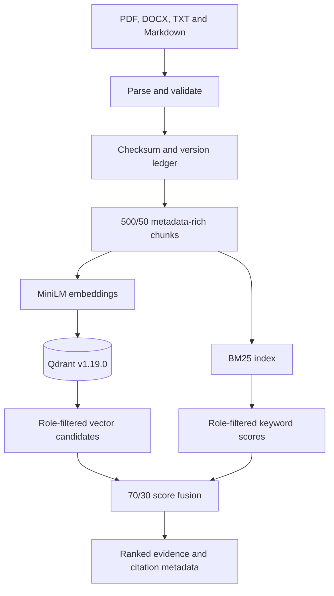

# Architecture: Enterprise Policy RAG

## Design goal

Return ranked evidence only when the requesting role is authorized to access the supporting policy text. Preserve document lineage and citation metadata throughout ingestion, indexing and retrieval.

The current implementation completes ingestion and retrieval. Answer generation, answerability gating, citation validation, API streaming and the user interface remain future layers.

## Current architecture



## Ingestion path

1. Accept PDF, DOCX, TXT or Markdown.
2. Sanitize filenames and reject path traversal or invalid file signatures.
3. Extract normalized page-aware text.
4. Validate document ID, title, version, effective date, department and roles.
5. Calculate a SHA-256 checksum.
6. Compare the checksum and version with the ingestion ledger.
7. Return `duplicate` for identical content already stored under the same version.
8. Reject changed content that attempts to reuse an immutable version.
9. Split text into 500-character windows with 50-character overlap.
10. Attach document lineage, roles, source location and character boundaries.
11. Write chunks atomically to version-specific JSONL storage.

Ingestion and vector indexing are intentionally separate commands. This makes failures recoverable and allows generated chunks to be inspected before they are embedded.

## Vector-indexing path

1. Load validated chunks through the shared `load_chunks()` function.
2. Construct searchable text from the title, section, department and body.
3. Generate normalized 384-dimensional vectors with `all-MiniLM-L6-v2`.
4. Create the Qdrant collection using cosine distance.
5. Create keyword payload indexes for:
   - `roles`
   - `chunk_id`
   - `document_id`
   - `department`
   - `version`
6. Generate a deterministic UUID from document ID, version and chunk ID.
7. Upsert the vector and complete metadata payload.
8. Wait for Qdrant to acknowledge each batch.
9. Report indexed chunks, stored points, elapsed time and throughput.

Deterministic UUIDs make repeated indexing idempotent. Re-indexing the 26 benchmark chunks keeps the collection at exactly 26 points.

## Retrieval path

1. Receive a natural-language query and requester role.
2. Generate the query vector with the same MiniLM model.
3. Send the vector and authorization filter to Qdrant.
4. Allow points whose `roles` payload contains either:
   - `all`
   - the requester’s exact role
5. Retrieve up to 20 authorized semantic candidates.
6. Independently calculate BM25 scores only for locally authorized chunks.
7. Normalize nonnegative vector and BM25 scores.
8. Combine scores using:
   - 70% MiniLM/Qdrant
   - 30% BM25
9. Sort by the combined score.
10. Return the top evidence chunks with document and citation metadata.

The command-line interface supports `vector`, `bm25` and `hybrid` strategies.

## Qdrant point schema

Each point contains:

| Component | Stored value |
|---|---|
| Point ID | deterministic UUID5 |
| Vector | 384-dimensional MiniLM embedding |
| Distance | cosine |
| Text | original chunk evidence |
| Identity | chunk ID and document ID |
| Lineage | version, effective date and checksum |
| Organization | department and authorized roles |
| Citation | title, section, source file and page number |
| Position | character start and end boundaries |

## Provider strategy

### Offline baseline

`HashingEmbeddingProvider` supplies deterministic 384-dimensional vectors for fast, network-free regression tests. It is a test baseline and is not presented as equivalent to a neural embedding model.

### Production retrieval

`MiniLMEmbeddingProvider` uses FastEmbed and ONNX Runtime with:

```text
sentence-transformers/all-MiniLM-L6-v2
```

The model produces normalized 384-dimensional embeddings without requiring a GPU or paid API.

### Vector persistence

`QdrantVectorStore` connects to Qdrant through its Python client and provides:

- collection creation
- payload indexing
- idempotent batch upserts
- exact stored-point counts
- role-filtered semantic search
- payload-to-domain-model reconstruction

### Hybrid fusion

`QdrantHybridRetriever` combines persistent semantic candidates with the existing BM25 index using 70/30 weighted score fusion.

## Security boundary

Authorization is enforced independently in both retrieval paths:

- Qdrant applies a payload filter before returning vector candidates.
- BM25 considers only chunks whose roles authorize the requester.
- Fusion operates only on authorized candidates.
- Restricted evidence is not passed to downstream answer generation.

The integration suite verifies that `all_employees` cannot retrieve restricted chunk `VM-02`, while the `legal` role retrieves it at rank one.

## Persistence and deployment

Qdrant runs through `compose.yaml` using:

- pinned image `qdrant/qdrant:v1.19.0`
- localhost-only ports 6333 and 6334
- persistent named volume `enterprise-rag-qdrant-data`
- automatic restart unless manually stopped

Container replacement was tested while retaining all 26 stored vectors.

## Evaluation boundary

The frozen benchmark contains 26 synthetic policy chunks and 20 ground-truth questions. The production hybrid path achieved 100% Hit@1, 100% Hit@3 and 1.000 MRR on this benchmark.

These results validate implementation correctness on the frozen dataset. They do not establish production-scale accuracy or generalization.

## Planned answer-generation path

The following components are not yet implemented:

1. Evidence-strength and answerability thresholds.
2. Grounded natural-language generation.
3. Inline document, section and version citations.
4. Citation-completeness validation.
5. Weak-evidence refusal behavior.
6. REST or streaming API delivery.
7. Redis caching.
8. Web interface.
9. Larger held-out and adversarial evaluations.